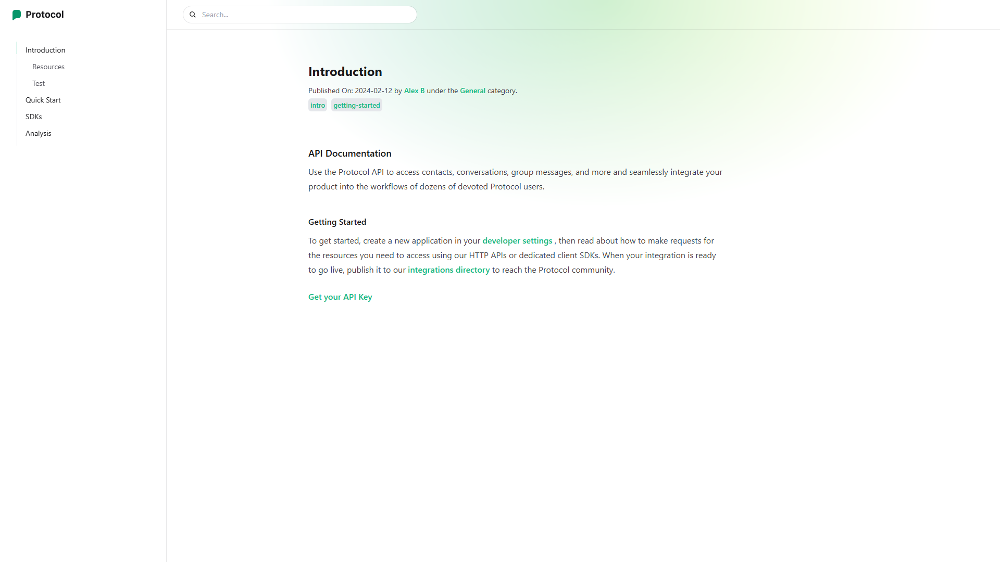
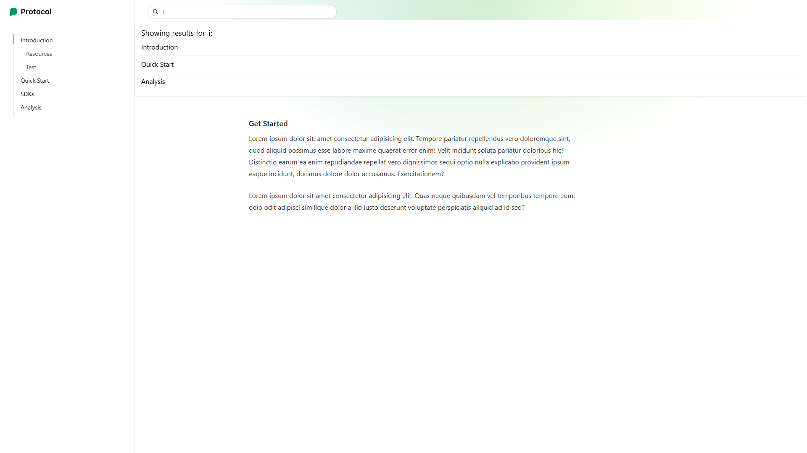

# 📘 DocuCraft - API Documentation Template

[Live Demo](https://docu-craft-nextjs-one.vercel.app/)

DocuCraft is a beautifully minimal and developer-friendly API documentation template built with **Next.js**, **Tailwind CSS**, and **Markdown** support via **gray-matter** and **remark**. It’s ideal for documenting APIs, SDKs, or developer onboarding materials with a clean and professional interface.

---

## ✨ Features

- 📚 **Markdown-Based Content** – Write docs in simple `.md` files
- 🧭 **Sidebar Navigation** – Auto-generated or configurable sections
- 🪄 **Tailwind Typography** – Clean, readable formatting with prose classes
- 💅 **Fully Responsive** – Mobile-first and adaptable UI
- 🔎 **Search Bar UI** – Optional searchable header
- 🎨 **Dark UI Style** – Developer-focused aesthetic
- ⚡ **Fast and Optimized** – Powered by Next.js 14 with modern tooling

---

## 🛠️ Tech Stack

| Technology            | Description                            |
|------------------------|----------------------------------------|
| **Next.js 14**         | React framework with file-based routing |
| **React 18**           | Core UI library                        |
| **Tailwind CSS**       | Utility-first CSS framework            |
| **gray-matter**        | Markdown frontmatter parsing           |
| **remark + remark-html** | Markdown to HTML transformation      |
| **@tailwindcss/typography** | Beautiful prose formatting        |
| **@tailwindcss/aspect-ratio** | Aspect ratio utilities          |

